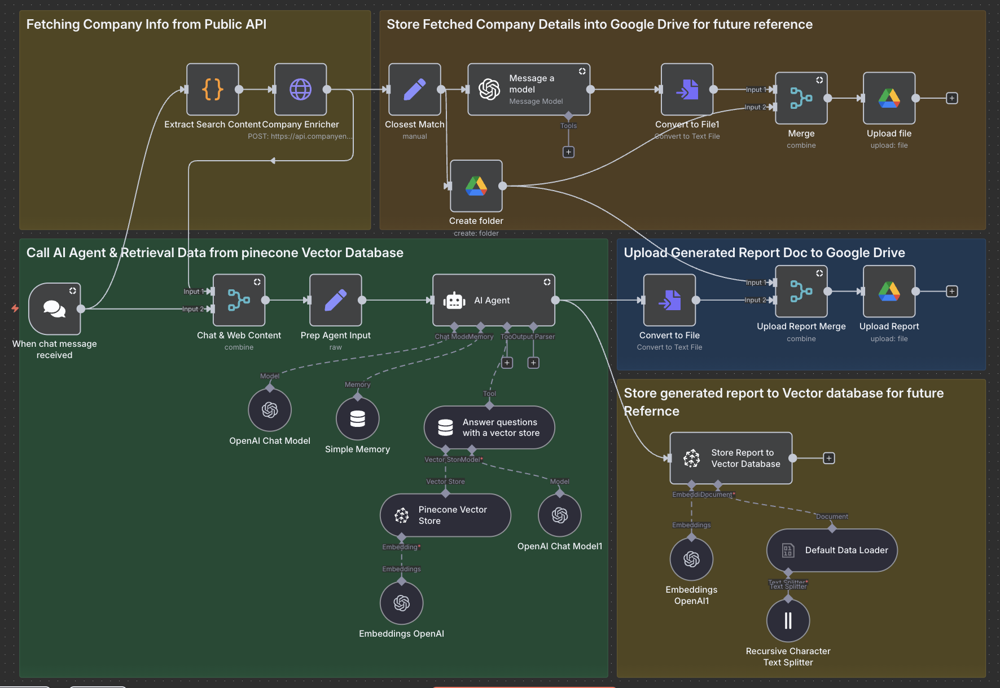

# upguard-home-test

This repository contains the UpGuard take-home test.
The project was primarily developed using the n8n.io platform

Domain : https://bolongwang.app.n8n.cloud

## Setup instructions

### Dependencies

This solution relies on the following services.
API keys and credentials are required for each service to enable the workflow:

1. [OpenAI](https://platform.openai.com/)
2. [Google Cloud Console](https://console.cloud.google.com/welcome?hl=en&inv=1&invt=Ab5_TA&project=n8n-playground-469414)
3. [Company Enrich service](https://app.companyenrich.com/)
4. [pinecone vector database](https://app.pinecone.io/)

### Setup Process

1. OpenAI API Key
   1. Sign up for OpenAI and generate an API key.
   2. Ensure access to: gpt-5-mini, gpt-4o-mini, and text-embedding-3-small.

2. Google Cloud OAuth Client
   1. Create an OAuth 2.0 Client ID in Google Cloud Console under APIs & Services → Credentials.
   2. Enable: Google Docs API, Google Drive API.
   3. For n8n cloud usage, publish the OAuth client if possible.

3. Company Enrichment Service:
   1. Register and obtain an API key for authenticated requests.

4. Pinecone Database Setup:
   1. Create a new index with the desired configuration.
   2. Generate an API key with read/write access for vector operations.

5. Environment Variables:
   1. Save all keys and credentials as environment variables.
   2. Reference .env.example for formatting.

## Solution Explanins

### User Journey

1. User enters a prompt like:
   "Create a Sales Preparation Report for <Company Name>, Website <Company Official Site>."
2. The workflow retrieves company information via the Company Enrichment service, using the website to ensure accuracy.
3. A folder named "Sales Preparation Report - <Company Name>" is created in Google Drive to store all related files.
4. A reference file "Company Details - <Company Name>.txt" is generated in the folder.
5. The AI agent, in collaboration with the vector database, generates the final report:
   "Sales Preparation Report - <Company Name>.txt" stored in the same folder.

### Workflow High level design

The workflow consists of 5 main blocks:

1. Retrieve Company Details – Fetch from Company Enrichment service.
2. Save Company Details – Store Company Details.txt in Google Drive.
3. Chat with RAG Agent – Interact with OpenAI models:
   1. gpt-5-mini for conversation
   2. gpt-4o-mini for analysis
   3. text-embedding-3-small for vector storage
4. Save Final Report – Store Sales Preparation Report.txt in Google Drive.
5. Update Vector Database – Save report embeddings.

## Folders Structure

1. input/
   1. Sales Preparation Report Template.pdf – Reference template used for embeddings and report generation.
2. output/ - Mirrors Google Drive folder structure.
   1. "Sales Preparation Report - <Company Name>" created dynamically based on user input.
      1. "Company Details - <Company Name>.txt" – formatted company data for reference.
      2. "Sales Preparation Report - <Company Name>.txt" – final generated report.
3. .env.example – Sample environment variables.
4. workflow.json – n8n workflow configuration.

## Assumptions

1. The Sales Preparation Report template is reusable across all users.
2. Sales agents may review reports against company details.
3. The AI agent handles only Sales Preparation Reports.
4. Users have access to Google Drive. Storage could be extended to AWS S3 or Azure.

## Limitations of your solution

1. Providing both company name and website improves accuracy.
2. User input must be precise; mismatched names/websites can cause errors.
3. Each report triggers API calls and creates a new folder.
4. The AI agent handles full RAG workflow with minimal user interaction.
5. Infrastructure is manually configured.
6. Limited integrations available in the n8n cloud setup.

## How you would improve it if you had more time

1. Implement a unique key for each company to improve accuracy.
2. Introduce a caching layer to reduce repeated API calls.
3. Centralize storage of generated events for AI agent memory and reuse.
4. Add a report evaluation system to improve quality over time.
5. Use Terraform or similar tools for consistent infrastructure management.
6. Self-hosted n8n instance – Provides greater functionality and simplifies the implementation of security configurations.
7. MCP server integration – Can extend the workflow to additional tasks, such as managing Jira tickets, GitHub commits, and more.
