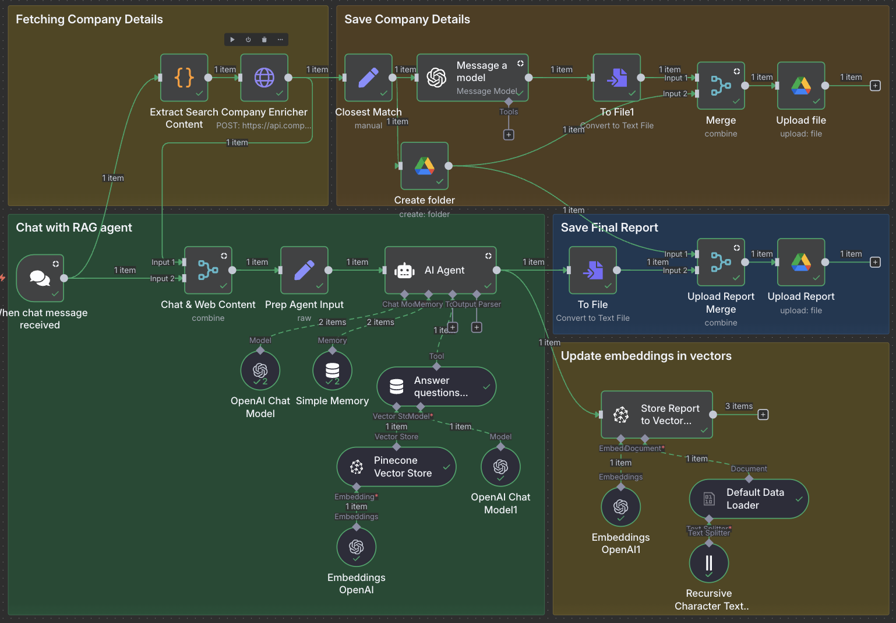

# upguard-home-test

This Repo is for upguard take home test
The main platform used to develop this project is n8n.io

Domain : https://bolongwang.app.n8n.cloud

## Setup instructions

### Dependencies

The solutions was build based on following depencies
API keys and secrets are needed for each of these following service to enable this workflow

1. [OpenAI](https://platform.openai.com/)
2. [Google Cloud Console](https://console.cloud.google.com/welcome?hl=en&inv=1&invt=Ab5_TA&project=n8n-playground-469414)
3. [Company Enrich service](https://app.companyenrich.com/)
4. [pinecone vector database](https://app.pinecone.io/)

### Setup Process

1. OpenAI API Key
   Sign up for an OpenAI account if you don’t already have one.
   Generate an API key from the OpenAI dashboard.
   Make sure the key has access to the following models:
   - gpt-5-mini
   - gpt-4o-mini
   - text-embedding-3-small
2. Google Cloud OAuth Client
   Go to the Google Cloud Console
   Create a new OAuth 2.0 Client ID under APIs & Services → Credentials.
   Enable the following APIs for your project:
   - Google Docs API
   - Google Drive API
     For n8n cloud usage, it’s recommended to have your OAuth client published.
3. Company Enrichment Service
   Register an account and obtain an API key.
   Keep the API key securely stored for authenticated requests.
4. Pinecone Database Setup
   Create an account at Pinecone.
   Set up a new index with the desired configuration (e.g., vector dimension, similarity metric).
   Generate an API key for accessing the index.
   Ensure the API key has permissions to read and update vectors.
5. Ensure all above API KEY and Credentials as saved as environment variables, format can reference from
   .env.example

## Solution Explanins

### User Journey

1. User input prompt "Create/Generate me a Sales Preparation Report for <Company Name>, Website <Company Official Site>"
2. Workflow will fetch company information from Company Enrich service base on <Company Name> and <Company Official Site>(official site link will used to narrow down to precised company to avoid ambiguity)
3. generate a folder named "Sales Preparation Report - <Company Name>" in linked gooogle drive,
   Considerations: Customer may work on case by case, this folder can be used to record all relatived files of one case(company)
4. For referencing purpose, Company Details - <Company Name>.txt file will created in folder generate in step #3
5. Company Details will be used by AI Agent collarborating with Vector Database to generate a final
   "Sales Preparation Report - <Company Name>.txt" Under folder created in #stage 3

### Workflow High level design

There are 5 blocks in this workflow.

1. Fetching Company Details - Fetch From Company Enrich service
2. Store Company Details - Store Company Details.txt to google drive
3. Chat with RAG agent - Chat with OpenAI Model (using gpt-5-mini for chat and gpt-4o-mini for analysis, text-embadding-3-small for vector database)
4. Store Final Report - Store Sales Prepartion Report.txt to google drive
5. Store embeddings in vectors - Store generated Report to vector database

## Folders explanations

1. input: input of workflow
   Sales Preparation Report Template.pdf : processed by embedding model and stores in pinecone vector database, this template will
   be used as a reference template for each task.

2. output: output of workflow : the folder structure of google drive, the folder structure is same as google drive folder structure

- "Sales Preparation Report - Google" folder:
  This folder was generated on the fly based on user chat input.
  For example, when user type "Create/Generate me a Sales Preparation Report for <Company Name>, Website <Company Official Site>"
  Workflow will take the part after "for" and before next "," as the Company Name, it will then generate this folder on the fly.

  - "Company Details - Google.txt" : formatted results of company enrich process, stores in the same folder of current task,
    stored for reference, incase sales person would like to refine the Preparation report. The file was generated a .txt file for easy to read
    by non technicals.
  - "Sales Preparation Report - Google.txt": The final report generated by the workflow. The file was generated a .txt file for easy to read
    by non technicals.

3. .env.example: sample environment variables to enable this workflow
4. workflow.json: the downloaded version of n8n workflows

## Limitations of your solution

## How you would improve it if you had more time
